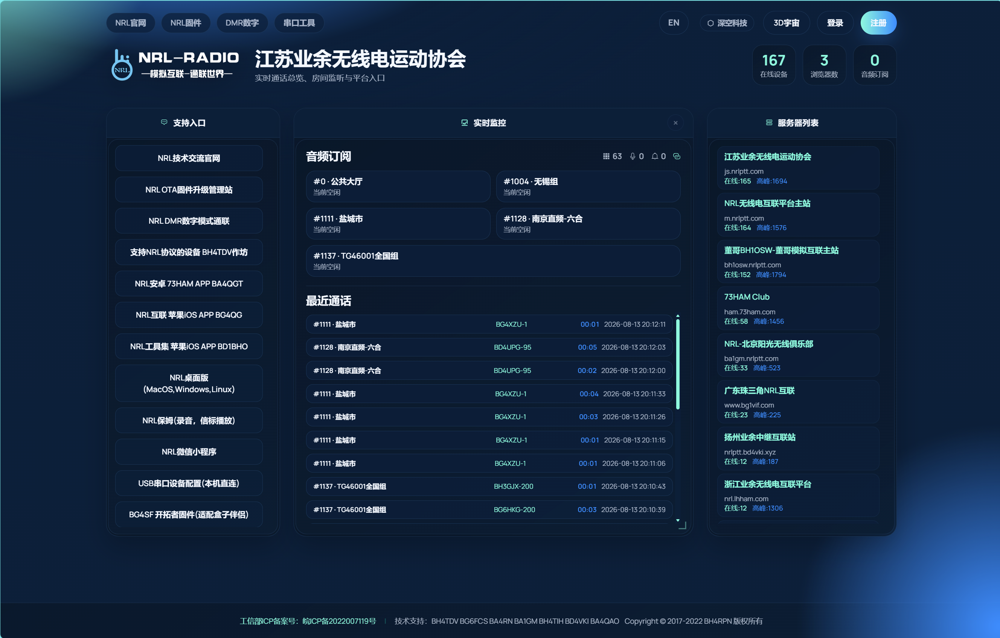

# NRL 互联管理平台 Web 前端（nrllink-web）

> 通过网络连接无线电 —— 业余无线电（HAM）跨地域、跨设备语音互联系统的 **Web 管理控制台**。
>
> Network Radio Link (NRL) — the web management console of an amateur-radio voice interconnection platform that links repeaters, radios, hardware boxes and mobile apps over the Internet.

Copyright (c) 2017-present BH4RPN

---

## 项目简介 / Overview

`nrllink-web` 是 NRL 互联平台的浏览器端控制台，与 Go 后端（`nrllink` 服务）配合使用。它面向三种角色提供服务：

- **HAM 玩家**：注册账号、绑定/管理设备、加入群组房间、远程下发 AT 指令配置设备、浏览中继频点、账号续费、实时语音旁听。
- **管理员（admin / master）**：管理用户、注册审核、群组、服务器节点、平台配置、收费套餐、操作日志。
- **访客**：无需登录即可进入 3D 别墅宇宙、实时呼叫监控面板、串口配置工具。

It is the web console of the NRL amateur-radio link platform, working with the Go backend. It serves HAM players (device/group management, remote AT configuration, billing, live voice monitoring), administrators (users, registration review, groups, servers, platform config, billing packages, logs) and guests (3D villa universe, live call monitor, serial tool).

---

## 技术栈 / Tech Stack

| 层 | 技术 |
| --- | --- |
| 框架 | Vue 3 (Composition API) + Vue Router（hash 模式）+ Pinia |
| 构建 | Vite+（`vp` 统一工具链，底层 Vite + Rolldown） |
| UI | Element Plus + ECharts + Three.js（3D 宇宙） |
| 语言 | vue-i18n 中/英双语 |
| HTTP | axios（请求拦截器自动携带 `X-Token`） |
| 实时语音 | WebSocket + G.711(a-law) Web Worker 解码 + WebAudio 播放 |
| 串口 | Web Serial API（浏览器直连 USB 串口设备） |
| 测试 | Vitest + jsdom |

---

## 快速开始 / Quick Start

本项目使用 [Vite+](https://viteplus.dev/guide/)（`vp` CLI）统一管理依赖安装、开发、构建与测试，**不直接使用 npm / pnpm / yarn**。

先安装 `vp`（macOS/Linux）：

```bash
curl -fsSL https://vite.plus | bash
```

然后：

```bash
# 安装依赖（vp 自动使用 pnpm 并管理其版本）
vp install

# 开发模式（默认端口 9527，/dev-api 代理到 https://js.nrlptt.com/）
vp dev

# 生产构建
vp build

# 预览构建产物
vp preview

# 单元测试
vp test

# 格式化 / Lint / 类型检查
vp check
```

也可通过 package.json 脚本（`vp run <script>` 或 `vpr <script>`）执行：

```bash
vp run dev          # = vp dev
vp run build:prod   # = vp build
vp run build:stage  # = vp build --mode staging
vp run test:ci      # = vp check && vp test run
```

环境变量说明见 `.env.development` / `.env.staging` / `.env.production`：

| 变量 | 说明 |
| --- | --- |
| `VITE_BASE_API` | API 基础路径（开发 `/dev-api`、生产同源空串、预发 `/stage-api`） |
| `VITE_PROXY_TARGET` | 开发代理目标（默认 `https://js.nrlptt.com/`） |
| `VITE_APP_TITLE` | 应用标题 |

---

## 构建与部署 / Build & Deploy

构建产物输出到 `dist/`，由后端 `/` 路由（`http.FileServer`）或 nginx 托管。

```bash
# 1. 本地构建
vp build

# 2. 批量部署到多台 NRL 服务器（见 deploy.sh）
./deploy.sh
```

`deploy.sh` 会把 `dist/` 打包，通过 scp/ssh 分发到内网构建机（`192.168.35.40`）及多台公网 NRL 节点，并在各节点用「备份旧目录 → 新版本切成 www」的方式原子切换。

详细部署与架构见 [docs/系统架构.md](docs/系统架构.md)。

---

## 文档索引 / Documentation

| 文档 | 说明 |
| --- | --- |
| [docs/功能说明.md](docs/功能说明.md) | 完整功能说明（前端页面 + 后端能力、角色权限、API） |
| [docs/系统架构.md](docs/系统架构.md) | 系统架构（总体、房间模型、语音机制、协议、部署、组件清单） |
| [docs/summary.md](docs/summary.md) | Vue3 迁移整理摘要 |
| [docs/vue3-migration.md](docs/vue3-migration.md) | Vue2 → Vue3 / Vite / Pinia 迁移记录 |

界面截图：

---

## 目录结构 / Project Layout

```
src/
├── api/          # API 请求封装（user/device/group/relay/billing/config/...）
├── assets/       # 静态资源（logo、404 图片等）
├── components/   # 通用组件
├── composables/  # 组合式函数（useUniverseData 等）
├── config/       # 全局配置
├── directive/    # 自定义指令
├── icons/        # SVG 图标
├── lang/         # 中英文国际化
├── layout/       # 主布局（侧边栏、顶栏、tags-view 等）
├── router/       # 路由（constantRoutes + asyncRoutes，按角色过滤）
├── store/        # Pinia（user/permission/settings/tagsView/app/errorLog）
├── styles/       # 全局样式（含平台主题变量）
├── three/        # 3D 别墅宇宙场景（UniverseApp）
├── utils/        # 工具（request/serial/register/system/...）
├── views/        # 页面视图
│   ├── login/    # 登录门户（统计栏、实时监控、服务器列表、3D 宇宙入口）
│   ├── register/ # 注册（执照上传）
│   ├── dashboard/# 平台统计
│   ├── pub/      # 设备群组：设备列表 / 群组房间 / 频点管理
│   ├── renew/    # 账号续费（微信支付）
│   ├── setup/    # 系统设置：群组/节点/服务器配置/用户/注册/套餐/角色
│   ├── log/      # 操作日志
│   ├── profile/  # 个人中心
│   ├── universe/ # 3D 别墅宇宙
│   └── serial/   # 串口配置工具
```

---

## License

MIT（部分组件/模板来源于 [vue-element-admin](https://github.com/PanJiaChen/vue-element-admin)）。
