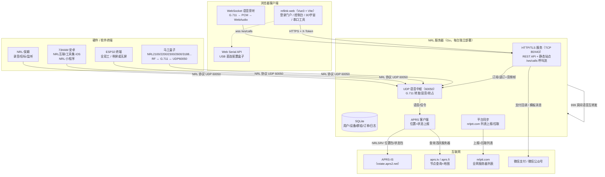
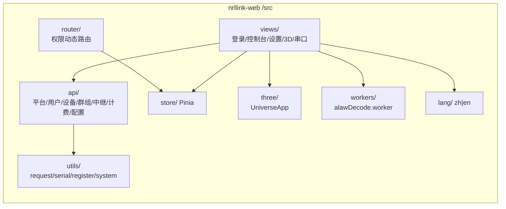
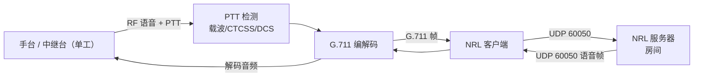
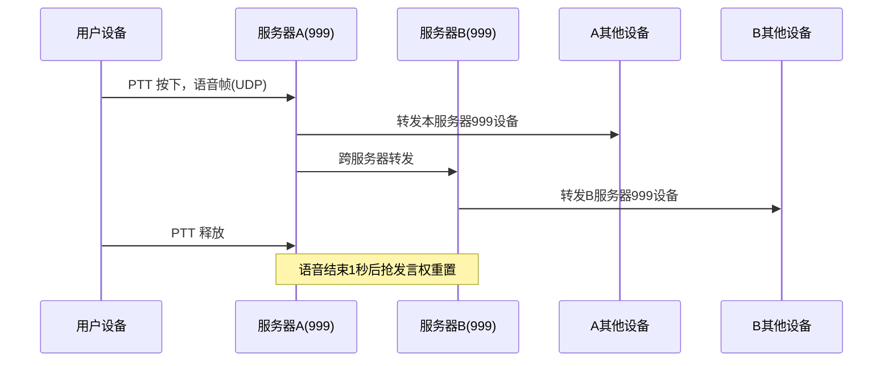

# NRL 平台系统架构 / System Architecture

> NRL（Network Radio Link）—— 通过网络连接无线电，实现跨地域、跨设备的业余无线电语音互联系统。
> 本文档覆盖 **Web 前端**（`nrllink-web`）、**Go 后端**（`nrllink`）、**硬件/软件终端** 与 **部署架构**。
>
> NRL (Network Radio Link) connects radios over the Internet for cross-region amateur-radio voice interconnection. This document covers the web frontend, the Go backend, client terminals and deployment.

---

## 一、总体架构 / Overall Architecture



**界面截图 / Screenshot**：

---

## 二、前端架构 / Frontend Architecture

### 2.1 技术栈分层 / Technology Layers

| 层 / Layer | 说明 / Description |
| --- | --- |
| UI 框架 | Vue 3（Composition API）+ Element Plus + ECharts + Three.js |
| 状态管理 | Pinia（user / permission / settings / tagsView / app / errorLog） |
| 路由 | Vue Router hash 模式；`constantRoutes`（免登录）+ `asyncRoutes`（按角色过滤） |
| 请求 | axios 实例：超时 10s、`withCredentials`、请求带 `X-Token`、响应校验 `code===20000` |
| 国际化 | vue-i18n 中/英 |
| 构建 | Vite（手写 chunk 分包：three / xlsx / element-plus / echarts / codemirror / vendor） |

### 2.2 前端模块划分 / Frontend Modules



### 2.3 运行时数据流 / Runtime Data Flow

- **登录**：`/user/login` → 保存 token → `getInfo`（`/user/info` 返回 roles/id/callsign/dmrid/mdcid/expire_time/package_type/billing_enabled 等）→ 按角色生成动态路由。
- **实时语音旁听**：`wss://<host>/ws/calls?token=` → 收到房间快照/统计/最近呼叫 JSON + G.711(alaw) 二进制音频帧 → `alawDecode.worker` 解码为 8kHz PCM → WebAudio 播放；订阅/退订消息 `{action:'subscribe'|'unsubscribe', room_keys:[]}`，心跳 `ping` 每 10 秒。
- **串口配置**：Web Serial → `SerialATClient`（AT 指令 / 寄存器 `AT+SET=READ/WRITE`）。

---

## 三、后端架构 / Backend Architecture

### 3.1 进程模型 / Process Model（`main.go`）

| 启动步骤 | 说明 |
| --- | --- |
| `conf.init()` | 加载 `udphub.yaml`（损坏时回退 `.bak`） |
| IP 库加载 | `ipdb.NewCity`（位置/归属地） |
| `setQTH("MEETLY-201", ...)` | 内置会议模式测试组 |
| `getDB()` + `updatedb()` | 打开 SQLite 并做增量迁移 |
| `chatgptInit()` | AI 聊天初始化 |
| 内存初始化 | `initAllUserList` / `initPublicGroup` / `initAllDevList` |
| 服务启动 | `jsonhttp.init()`（HTTP）+ `callWSHub.run()`（呼叫流）+ `udpServer()`（语音）+ 各定时任务 |

### 3.2 并行运行单元 / Concurrent Units

| 单元 | 职责 / Responsibility |
| --- | --- |
| `udpServer` | UDP 60050 语音中枢：设备注册、组内转发、抢占、混音 |
| `jsonhttp` / `msghttp` | REST API + 微信回调 + 静态站点（`http.FileServer(conf.Web.Path)`） |
| `callWSHub` | `/ws/calls` 呼叫流：房间快照 + G.711 音频帧推送给浏览器 |
| `tcpclient` / `tcphub` | 设备 TCP 通道相关 |
| `checkdeviceOnline` | 在线设备心跳检测 |
| `cronGetWxToken` | 微信公众号 access_token 定时刷新 |
| `NewAPRS().OnLoad` | APRS 上报/发现循环 |
| `startPlatformServerSync` | nrlptt.com 平台列表同步循环 |
| `saveLog` | 呼叫日志异步落盘 |
| `go jsonhttp.init()` | HTTP 服务 goroutine |

### 3.3 房间（群组）模型 / Room Model

| 房间范围 | 类型 | 权限 | 说明 |
| --- | --- | --- | --- |
| 1 – 3 | 用户私有 | 仅该用户 | 每用户独享，外人无法进入 |
| 4 – 996 | 保留号段 | — | 预留 |
| 997 | 未分配 | — | — |
| 998 | 内置鹦鹉房间 | 所有用户 | 每台设备独立录制并回放自己的语音 |
| 999 | 全网互通 | 所有互联服务器 | 发言自动转发至所有服务器 999 房间 |
| 1000+ | 公共房间 | 所有用户 | 多设备同房间通联 |
| 任意 | 会议模式 | 同房间用户 | 全双工 PCM 混音 |

**发言机制（按在线设备数自动切换）**：

| 在线设备数 | 模式 | 说明 |
| --- | --- | --- |
| 1 台 | 静默 | 普通房间不自动录音回放 |
| 2 台 | 自动全双工 | ESP32 / App 免按 PTT 通话 |
| 3+ 台 | 单工抢占 | 先到先得，松开 PTT 后 **200ms** 释放 |

### 3.4 数据存储 / Data Storage（SQLite）

用户（users，含 dmrid/mdcid/expire_time）、设备（devices，含 dmrid/priority/status）、公共群组（public_groups，含 allow_callsign_ssid）、注册申请（reg_users）、中继模板（relay）、服务器节点（servers）、计费套餐（billing_packages）、订单（billing_orders）、操作日志（operatorlog）、路由（routes）。

---

## 四、语音协议与数据流 / Voice Protocol & Data Flow

### 4.1 马工盒子射频桥接 / RF Bridging



### 4.2 999 全网互通数据流 / Inter-server (999) Flow



---

## 五、服务器自动发现 / Server Auto-Discovery

双机制并行，互为补充：

| 对比 | APRS 机制（主要） | nrlptt.com 官网机制（备用） |
| --- | --- | --- |
| 上报 | 立即→1分→5分→每10分钟 | 启动立即，之后每 3 分钟 |
| 同步 | 每 60 秒查 aprs.tv | 启动立即，之后每 5 分钟 |
| 中转 | APRS-IS + aprs.tv | nrlptt.com 直连 |
| 附加 | GPS 位置、地图可见 | 仅服务器列表 |
| 配置 | 呼号/位置/APRS 服务器 | 仅 SelfAddress + SelfPort |

**APRS 节点标识**：`NRLSRV`（服务器）/ `NRLBOX`（硬件）/ `NRLAPP`（App）/ `NRLMP`（小程序）。

---

## 六、部署架构 / Deployment Architecture

### 6.1 部署形态 / Deployment Shapes

| 形态 | 说明 |
| --- | --- |
| Linux 原生 | 解压运行 `./nrllink`，`nrllink.service` systemd 管理 |
| Docker | `docker pull hicaoc/nrllink:latest`，映射 `80:80`、`60050:60050/udp`，挂载 `/data`、`/conf` |
| Windows | `nrllink_windows_x86_64.exe` 直接运行 |
| 对外发布 | nginx HTTPS 443 → 内部 TCP 80（前端 `dist/` + API 同源） |

### 6.2 端口规划 / Ports

| 端口 | 协议 | 用途 |
| --- | --- | --- |
| 80 | TCP | Web 管理后台（内部，`http.FileServer` + API + `/ws` `/ws/calls`） |
| 443 | TCP | HTTPS 对外入口（nginx 反代） |
| 60050 | UDP | 设备语音/控制信令 |

### 6.3 批量发布 / Release Flow（`deploy.sh`）

```text
vp build → dist/
  → tar.gz 打包一次
  → scp 到内网构建机 192.168.35.40（/root/nrllink/nrllink/www）
  → 逐台 scp 到 hostlist 各公网节点
  → 每节点：解压到 /nrllink/<版本目录>，mv www → www.bak.<时间戳>，
            mv <版本目录> → www（原子切换，失败可回滚）
```

---

## 七、组件清单 / Component Inventory

| 类型 | 组件 | 说明 |
| --- | --- | --- |
| 服务器 | NRL 服务器（Go） | 房间/设备/用户管理、语音转发、混音、发现、计费 |
| 服务器 | Web 前端（nrllink-web） | 控制台、3D 宇宙、串口工具、实时旁听 |
| 硬件 | 马工盒子 NRL 系列 | 射频桥接、单工、G.711 |
| 硬件 | ESP32 终端 | 全双工、可选屏、WiFi |
| 软件 | 73HAM（安卓）、NRL 互联/工具集（iOS） | NRL 对讲客户端 |
| 软件 | NRL 微信小程序 | NRLMP 标识 |
| 软件 | NRL 保姆 / 增强版保姆 | 录音、定时信标、多房间监听 |
| 外部 | APRS-IS / aprs.tv | 节点发布与自动发现 |
| 外部 | nrlptt.com | 全网服务器列表同步 |
| 外部 | 微信支付 / 微信公众号 | 计费与通知 |

---

## 八、典型应用场景 / Typical Scenarios

1. **本地中继接入全网**：本地中继台 → 马工盒子 → 服务器A(999) → 所有互联服务器(999) → 全网用户。
2. **手机与电台通联**：73HAM App → 服务器B(1000 房间) ← ESP32 终端 ← 本地对讲机。
3. **多地监听**：增强版保姆同时连接多台服务器多个房间，实现多地中继台同步监听。
4. **用户私有通信**：用户设备在房间 1（私有），外人无法进入。

---

## 九、安全与运维 / Security & Operations

- **认证**：token（`X-Token`）+ 后端 `checktoken` 校验；写操作按角色校验并写操作日志。
- **配置安全**：`/config/update` 仅 admin；YAML 保存先写临时文件再 rename，保留 `.bak`。
- **数据安全**：SQLite 单文件持久化，Docker 挂载 `/data`、`/conf`。
- **部署安全**：多节点原子切换，旧版本保留 `www.bak.*` 便于回滚。
- **测试**：前端 Vitest + jsdom（`vp check && vp test run` = lint + 单测）；后端 Go 单测（`nrllink_test`、`opus_audio_test` 等）。

---

## 十、相关文档 / Related Docs

- [功能说明.md](./功能说明.md) — 完整功能清单
- [summary.md](./summary.md) — Vue3 迁移整理摘要
- [vue3-migration.md](./vue3-migration.md) — 迁移记录
- [../nrllink/doc/系统架构.md](../nrllink/doc/系统架构.md) — 后端详细架构
